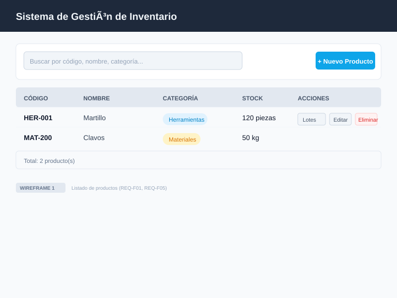
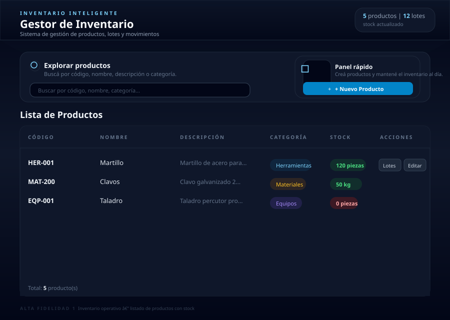

# Wireframes y Pantallas de Alta Fidelidad

## Wireframes (baja fidelidad)

Tres pantallas en formato wireframe que cubren los requisitos funcionales del sistema.

### Wireframe 1: Listado de inventario

Cubre REQ-F01 (CRUD de productos) y REQ-F05 (consulta de inventario).

### Wireframe 2: Detalle de producto y lotes

Cubre REQ-F02 (gestión de lotes) y REQ-F05 (detalle de inventario).

### Wireframe 3: Movimientos de lote

Cubre REQ-F03 (movimientos de stock) y REQ-F04 (validación de egresos).

---

## Pantallas de alta fidelidad

Dos pantallas con el diseño visual final del sistema (tema oscuro, paleta slate/sky).

### Alta fidelidad 1: Inventario operativo

Listado de productos con búsqueda, badges de categoría, indicadores de stock y panel rápido. Diseño final con gradiente, tipografía y paleta de colores del sistema.

### Alta fidelidad 2: Detalle de lote con movimientos

Vista de detalle de lote con tarjetas de información, historial de movimientos con badges de ingreso/egreso y modal de registro de movimiento con validación de stock disponible.
